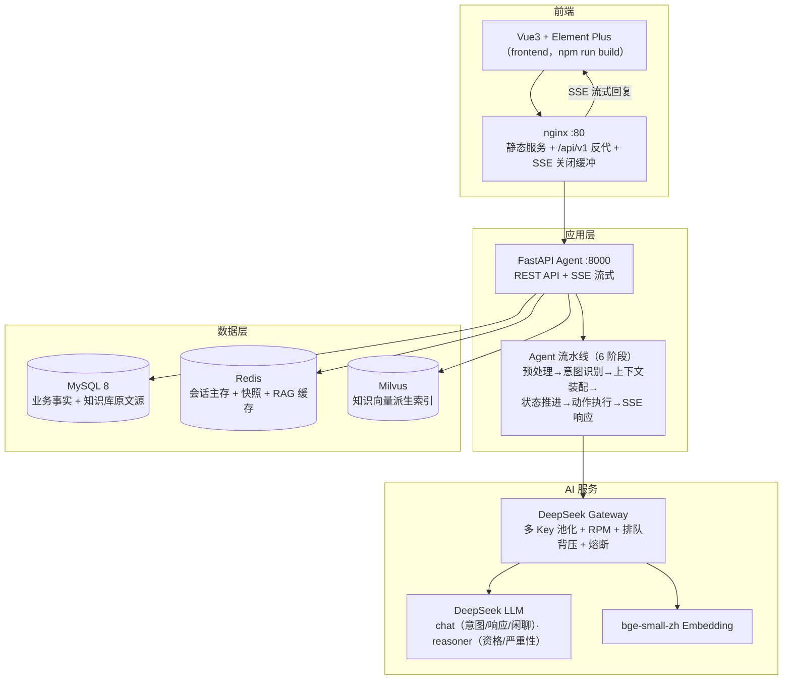

# AI 智能客服系统

> **高并发 AI Agent 智能客服系统**：面向电商售后场景，从**退换货政策问答、订单状态查询**，到**退货、仅退款、投诉**等可完成的业务动作，在对话内一站式闭环，并具备从 **Agent 编排、LangGraph 状态机、RAG 检索、存储高可用到 LLM 网关治理**的全链路工程化能力。

本系统是**生产级全栈演示项目**：一键启动全栈容器（backend/nginx/mysql/redis/Milvus）、4 大售后场景数据开箱即演示、138 项后端测试 + 41 项前端测试全绿、SSE 契约化流式全链路可观测、LLM 工具决策 + 实时护栏（P3-P5）、DeepSeek 多 Key 网关 + 熔断降级**永不因 LLM 故障崩溃**。

---

## 目录

- [一、项目简介：解决什么痛点](#一项目简介解决什么痛点)
- [二、业务价值：给谁带来什么](#二业务价值给谁带来什么)
- [三、技术闪光点](#三技术闪光点)
- [四、系统架构](#四系统架构)
- [五、技术栈一览](#五技术栈一览)
- [六、快速开始（3 步跑起来）](#六快速开始3-步跑起来)
- [七、演示场景](#七演示场景)
- [八、目录结构](#八目录结构)
- [九、测试与验收](#九测试与验收)
- [十、开发指南](#十开发指南)
- [十一、常见问题](#十一常见问题)
- [附录：状态机数据契约（LangGraph State）](#附录状态机数据契约langgraph-state)

---

## 一、项目简介：解决什么痛点

电商售后的高频咨询与业务办理长期依赖人工客服，存在四个典型痛点：

- **人力成本高**：退货/退款/投诉等重复性售后占客服工单大头，逐单人工处理，成本随订单量线性增长；
- **政策口径不统一**：退货时限、仅退款资格、定制商品规则散落在客服记忆与 Excel 里，同一问题不同人答案不一，易引发客诉；
- **业务动作断层**：传统问答机器人能"说"不能"做"，退货/退款仍需跳转人工工单，对话内无法闭环；
- **峰值流量易崩**：LLM 单 Key 限流、Redis/MySQL 单点故障、向量库结果不可信，大促流量下系统直接不可用。

本系统针对以上四个痛点，提供四大核心能力：

| 能力 | 实现 | 对应痛点 |
|------|------|---------|
| **对话式业务办理** | LangGraph 状态机驱动退货/仅退款/投诉，每步落库真实可查，支持部分退货多轮指定 | 人力成本 |
| **政策问答** | MySQL 原文源 + Milvus 向量 + RAG 检索，命中/未命中都有兜底，绝不编造 | 口径不一 |
| **订单/进度查询** | 对接层抽象 + 意图切换快照，对话内随时查单、中途切流、断点恢复 | 业务断层 |
| **高可用工程** | DeepSeek 多 Key 网关 + StorageRouter 双写 + 熔断降级，LLM/存储故障系统不崩 | 峰值崩溃 |

---

## 二、业务价值：给谁带来什么

### 对用户（消费者）
- **对话内闭环办成事**：退货、仅退款、投诉在聊天里直接完成，每一步落到数据库，退单号/退款/工单号真实可查；
- **部分退货自由指定**：任意轮次可补「只退手机壳」，确认页所见即所退，避免退错全量；
- **政策有依据**：RAG 检索知识库 → LLM 结合政策回答，空结果明确引导人工而非编造。

### 对客服运营 / 管理员（`role=admin`）
- **知识库自助维护**：文档级上传 / 编辑 / 删除 / 全量同步，MySQL 存原文、Milvus 存向量，一致性强；
- **订单数据可控**：订单 + 商品明细增删改，可模拟任意订单状态用于测试；
- **一键重置测试数据**：清空业务流水、恢复种子订单，测试无限重跑；
- **降级保障**：LLM 熔断走规则引擎 10 条正则兜底，系统永不因 AI 故障崩溃。

### 对开发 / 架构
- **可演进**：对接层 ABC 接口（`IOrderService` 等），Local → Remote 微服务 **Agent 代码零改动**；
- **可观测**：JSON 结构化日志每请求 1 进 1 出 + 6 阶段各 1 条 + LLM/DB 埋点，注入 `session_id`/`intent`/`latency_ms` 全链路追踪；
- **可验收**：SSE 契约 §5.1 事件齐备、`usage`/`done` 必选、`answer` 拼接 == `done.content`，评测平台可自动发现（`GET /api/contracts`）。

---

## 三、技术闪光点

### 1. DeepSeek Gateway：多 Key 池化 + 排队背压 + 熔断（高并发核心）
单 Key 有 RPM 上限，撑不起海量并发——**控制并发比加连接数更重要**：
- **KeyPool**：多 Key 滑动窗口 RPM 追踪，选负载最低的 healthy Key；429 → 自动冷却，5xx → 换 Key 重试（最多 2 次）；
- **排队背压**：无 healthy Key 时排队 2s，超时返回容量告警，不无限堆积；
- **熔断降级**：全部 Key 冷却 → 触发规则引擎兜底（10 条正则，O(n) 匹配），系统永不因 LLM 故障崩溃；
- **usage 全计**：一轮内多次 LLM 调用（意图分类 + 生成 + 资格判定）token 用量经 contextvar 聚合，`done` 前补发单条 `usage` 事件透传评测平台。

### 2. StorageRouter：Redis 主存 + MySQL 双写自动切换（存储高可用）
- Redis 为主存储（会话/快照/缓存），MySQL 异步兜底双写；
- Redis 故障 → 自动切 MySQL 模式；后台 5s 探测 Redis，恢复后自动切回，日志记录 `storage_mode_switch`；
- MySQL 兜底读取时重建最近 10 条消息 + 摘要，保证 LLM 上下文完整。

### 3. RAG 一致性：MySQL 为源 + Milvus 派生索引（数据完整性）
- **根除行业通病**：纯向量库方案下 chunks 是"可变快照"，改过就无法还原原文；本项目改为 **MySQL 存原始 Markdown（source of truth），Milvus 只存分块向量快照（LlamaIndex 管理）**，每次从源重新生成，不独立演进；
- **一致性策略**：写向量失败 → 标记 `pending` → 下次写操作增量补偿（O(失败数)），全量对账仅异常恢复时 admin 手动触发；
- **检索链路**：Embedding(bge-small-zh) → Milvus Top-10 → Re-rank Top-3 → Redis 精确缓存（TTL 600s）；空结果（score<0.3）不注入 prompt，回复引导人工。

### 4. LangGraph 状态机：可完成的业务动作 + 全局可打断
- **三个业务流**（退货/仅退款/投诉）各为一张图，每轮用户输入推进一节点，停在 `awaiting`（等待输入）或 `final`（终态）；
- **全局打断**：任一节点可 `取消 / 返回 / 更换 / 转人工`；说「转人工」优先触发渠道模板话术（关键词已收窄，不误触发「人工智能」）；
- **部分退货多轮指定**：任意轮可补「只退某商品」，items 槽合并进 `return_items`，资格重算后确认页展示子集及其金额；LLM 漏提取时以「只退/就退/只要退/仅退/单退 + 商品名」句式规则兜底（含量词/语气词/多商品/否定句式处理），规避退错全量风险；
- **意图切换 + 快照**：业务流中切到别的意图自动保存当前进度（按意图各存一份），回来输入「继续退货」即可恢复；
- **模型路由**：意图分类/响应/闲聊走 `deepseek-chat`（200ms-1s）；退货/退款资格判定、投诉严重性评估走 `deepseek-reasoner`（1-3s），超时降级 chat。

### 5. SSE 契约化：事件齐备 + usage 必选 + 流式一致性（契约 §5.1）
SSE 帧按 `event: <type>\n\ndata: {json}` 格式推送，前端 `useSSE.ts` 逐帧解析：

| 事件 | 必选 | 说明 |
|------|------|------|
| `meta` | 首帧 | 接口身份声明（`agent`/`interface`/`contract_version`） |
| `status` | 可选 | 阶段进度文案（前端进度条） |
| `reasoning` | 可选 | 状态机推理依据（如投诉严重性评估依据） |
| `tool_call` | 可选 | 工具动作透出（`query_order`/`create_return`/`create_complaint`…） |
| `answer` | 流式 | `answer.delta` 逐段文本（TTFT 起点） |
| `usage` | **必选** | token 用量聚合（prompt/completion/total + cache 命中/未命中） |
| `done` | **必选** | 收尾，携带最终 `content` 与 `session_id` |
| `error` | 失败 | 错误文案 |

- **answer 拼接 == done.content**：流式中途熔断/异常时 reply 拼接「已流部分 + 兜底」，`answer` 只补发新增段，前端拼接结果与 `done.content` 严格一致；
- **greeting 路径也补发**：新会话问候无 LLM 调用，同样补发 `answer` + `usage` + `done`，契约不因降级而缺帧；
- **标准契约端点**：`GET /api/contracts` 声明 agent 的评测接口与场景清单（chat/login + greeting/order_query/after_sales/human_handoff），供平台自动发现。

### 6. 并发与资源治理
- **同一会话串行锁**：`asyncio.Lock(session_id)` 防止双击发送导致状态覆盖；
- **SSE 断连自取消**：检测 `request.is_disconnected()`，自动保存进度并取消生成，防资源泄露；
- **优雅关闭**：停止接新请求 → 30s 宽限 → 保存活跃会话 checkpoint → 关闭连接池；
- **MySQL 写入重试**：连接错误/死锁指数退避（0.1/0.2/0.4s）3 次，失败统一兜底话术。

### 7. 对接层抽象：ABC 接口 + Local/Remote 实现（可演进架构）
Agent 只依赖 `IOrderService` / `IReturnService` / `IRefundService` / `IComplaintService` 等抽象接口，当前 Local 实现直连 MySQL，未来切 Remote（HTTP/gRPC 微服务）**Agent 代码零改动**。

### 8. 安全与可观测性
- **双层 Prompt Injection 防护**：预处理正则（零成本拦截）+ System Prompt 安全注入；
- **JWT 认证**：payload 含 role，Admin 接口权限隔离，前端按 role 显隐入口；
- **JSON 结构化日志**：每个请求 1 进 1 出 + 6 阶段各 1 条 + LLM 调用/DB 操作全埋点，注入 `session_id` / `intent` / `latency_ms`，支持全链路追踪；
- **会话消息体截断**：`SESSION_MAX_MESSAGES`（默认 40 条）超限截断为「首条 user 消息 + 最近 N-1 条」，防止会话无限增长（LLM/状态机不读消息全文，截断仅影响前端历史展示）。

### 9. 工程化质量
- **后端 138 项测试全绿**（另 3 项环境相关跳过）：意图分类（6 类准确率 >90%）、退货/退款/投诉状态机（7 节点 + 三级判定）、编排器（多轮商品合并、确认/取消 action 语义、转人工优先、流式一致性）、LLM 工具决策循环（护栏 allow/reject/override 三态、同参去重、累计调用截断）、SSE 契约（帧格式/usage 必选/answer-done 一致）、DeepSeek Gateway（429/5xx/超时重试、首 delta 后不重试）、部分退货规则兜底、RAG、StorageRouter、tool_call_log 落库、会话历史/消息截断、contracts 端点；
- **前端 41 项测试全绿**：ChatPanel 渲染、ChatInput、登录/注册表单、useChat/useSession/useSSE、formatTime、客服/登录/注册视图；
- **集成测试可重跑**：真实服务链路（会话 → SSE → 退单落库），服务未启动自动跳过不误报。

### 10. LLM 工具决策循环 + 实时护栏（P3-P5）
- **决策循环**：`ORDER_STATUS` / `POLICY_INQUIRY` 意图下，LLM 自主决定调只读工具（`search_policy` / `query_order` / `list_user_orders`），工具结果回灌后由生成节点组装回复；业务副作用工具（建退货/退款/投诉单、资格判定）的决策被护栏拦截，转由 LangGraph 状态机确定性接手——决策与执行分离，LLM 不裸调业务动作；
- **实时护栏 ToolGuardrail**：决策与执行之间的确定性规则校验，输出 `allow / reject / override` 三态 + 机器可读理由——副作用工具 reject→business、`search_policy` 过短/纯问候 reject、`query_order` 缺单号 override 为列最近订单、同轮同参数 dedupe 复用首次结果、累计工具调用 >3 截断强制出路由；
- **观测落库**：每次护栏判定写 `tool_call_log`（session / round / tool / verdict / reason / 结果摘要 / 延迟），落库失败静默不阻断决策；为管理侧调用分析预留数据底座。

---

## 四、系统架构



**核心链路（以退货为例）**：

```
「我要退货 ORD-20240801-001」
  → 预处理（Prompt 注入检测，零成本正则）
  → 意图识别 → RETURN_REQUEST（deepseek-chat，~200ms，JSON 容错 + 2 次重试）
  → 上下文装配（Redis 加载会话 + 恢复快照）
  → 状态推进（LangGraph：collect_order_id → verify_order → check_eligibility）
  → 动作执行（对接层查订单 / reasoner 资格判定 / RAG 检索）
  → SSE 响应（tool_call → reasoning → answer 逐段流式 → usage → done）
  → 确认后 EXECUTE 创建退货单落库
  → 回复：「退货单 RC-xxx 已创建，退款 ¥69.70 将在 1-3 个工作日内原路返回」
```

---

## 五、技术栈一览

| 层 | 技术 | 说明 |
|----|------|------|
| 后端 | Python 3.11 + FastAPI | async/await，SSE 流式，OpenAPI 自动文档 |
| 状态编排 | LangGraph | 三业务流状态机，每轮输入推进一节点 |
| 前端 | Vue3 + Vite + Element Plus + Pinia | 客服聊天 + Admin 管理后台，SSE 逐帧消费 |
| 关系数据库 | MySQL 8 | 业务权威数据 + 知识库原文源（source of truth） |
| 缓存/会话 | Redis 7 | 会话主存 / 快照 / RAG 精确缓存 |
| 向量库 | Milvus + LlamaIndex + bge-small-zh | 知识库派生向量索引，Top-10 → Re-rank Top-3 |
| LLM | DeepSeek（openai 兼容） | chat 意图/响应/闲聊 + reasoner 资格/严重性，超时降级 |
| 网关 | 自研 KeyPool + 熔断 | 多 Key 滑动窗口 RPM + 排队背压 + 规则引擎兜底 |
| 测试 | pytest + pytest-asyncio + vitest | 后端 138 / 前端 41，集成测试真实链路可重跑 |

---

## 六、快速开始（3 步跑起来）

> 前置：Docker + Docker Compose（`docker compose` v2 语法）、Node.js ≥ 18。

### 第 1 步：配置环境变量

```bash
cp .env.example .env
# 编辑 .env，必填两项：
#   DEEPSEEK_API_KEYS=sk-key1,sk-key2,...   # 多 Key 逗号分隔，越多并发越高
#   JWT_SECRET_KEY=<随机长字符串>            # 生产必须替换，如 python -c "import secrets;print(secrets.token_urlsafe(48))"
```

### 第 2 步：一键启动全栈容器

```bash
docker compose up -d
docker compose ps          # 等待全部 healthy
```

启动 `nginx` / `backend` / `redis` / `mysql` 与 Milvus 套件（`milvus` / `etcd` / `minio`）。MySQL 首次启动自动建表 + 灌入种子数据（5 个订单覆盖全场景），Milvus 由知识库启动同步自动灌入 4 篇预置政策文档。

### 第 3 步：构建前端并访问

```bash
cd frontend
npm install
npm run build             # 生产：构建产物挂载到 nginx
# 或 npm run dev           # 开发热更新（proxy /api → backend:8000，访问 http://localhost:5173）
```

**跑起来了**：浏览器打开 **http://localhost:80**，用演示账号登录。

| 角色 | 账号 | 密码 | 可做什么 |
|------|------|------|---------|
| 普通用户 | `user_1` | `123456` | 对话式退货/退款/投诉/查单/政策问答，预置 5 个订单 |
| 管理员 | `admin` | `admin123` | 知识库管理、订单管理、一键重置测试数据 |

**访问入口**（标准端口）：

| 入口 | 地址 | 用途 |
|------|------|------|
| 前端（生产） | http://localhost:80 | nginx 统一入口，含 API 反代 |
| 后端 API | http://localhost:8000/api/v1 | 开发调试（含 SSE） |
| 前端（开发热更新） | http://localhost:5173 | Vite dev server |
| **MySQL** | `localhost:3306`（csuser/cspass，库 `customer_service`） | 外部工具验证数据 |
| **Redis** | `localhost:6379` | 外部工具验证数据 |
| **Milvus** | 容器内 `milvus:19530`（宿主机联调经 override 映射 19533） | 外部工具验证向量库 |

> **端口冲突**：若宿主机 80/3306 已被其他项目占用，无需改 `docker-compose.yml`，创建本地 `docker-compose.override.yml` 覆盖端口即可（docker compose 自动合并，且已 gitignore 不入库）：
>
> ```yaml
> # docker-compose.override.yml（本机专用，可提交到个人分支或忽略）
> services:
>   nginx:  { ports: ["8081:80"] }      # 标准 80:80
>   mysql:  { ports: ["3308:3306"] }    # 标准 3306:3306
> ```

---

## 七、演示场景

预置数据（`user_1 / 123456`）可直接体验以下链路：

### 场景 1 · 单轮退货闭环（业务动作真实落库）
```
「我要退货 ORD-20240801-001」→ 回答原因 → 点确认 → 收到退货单号 RC-xxx
```
**观看点**：SSE 依次透出 `tool_call(query_order)` → `reasoning` → `answer` 流式 → `usage` → `done`；admin 订单管理里商品状态已流转。

### 场景 2 · 多轮部分退货（任意轮次指定商品）
```
「我要退货」→ 追问订单号 →「ORD-20240801-001」→「只退手机壳」→ 回答原因 → 确认页只见「手机壳×1，¥29.9」
```
**观看点**：确认页商品子集与金额精确匹配；LLM 漏提取时以「只退/就退/只要退/仅退/单退 + 商品名」规则兜底，指定商品不可退时明确提示。

### 场景 3 · 意图切换 + 快照恢复（多轮状态不丢）
```
「我要退货 ORD-20240801-001」进行到一半 →「查一下订单」→ 回复「已保存退货进度，先帮您查单」→「继续退货」→ 从断点恢复
```

### 场景 4 · 转人工与闲聊边界
```
说「转人工」→ 优先触发渠道模板话术（关键词已收窄，「你是人工智能吗」不会误触发）
连续闲聊第 4 轮 → 自动收束到规则话术
```

### 场景 5 · Admin 知识库与订单管理
`admin/admin123` 登录 → 知识库文档上传/编辑/删除 → 订单增删改模拟任意状态 → 一键重置测试数据。

---

## 八、目录结构

```
customer-service/
├── backend/                      # 后端源码（FastAPI）
│   ├── app/
│   │   ├── main.py               # 应用入口 + 生命周期（优雅关闭）
│   │   ├── api/                  # REST 路由 + SSE（routes / auth / deps / contracts）
│   │   ├── agent/                # Agent 编排
│   │   │   ├── orchestrator.py   # 6 阶段流水线 + SSE 事件发射 + 熔断兜底
│   │   │   ├── intent.py         # 意图分类（6 类：退货/退款/投诉/查单/政策/闲聊）
│   │   │   ├── rule_engine.py    # 规则引擎兜底（10 条正则，LLM 熔断时生效）
│   │   │   ├── usage.py          # token 用量聚合（contextvar，按 asyncio task 隔离）
│   │   │   ├── state_machine/    # 退货/退款/投诉状态机（LangGraph）
│   │   │   ├── function_calling/ # 工具 + 护栏（order/return/refund/policy tools、guardrail、tool_call_log）
│   │   │   └── prompts/          # prompt 模板（意图/闲聊/政策…）
│   │   ├── infrastructure/       # DeepSeek Gateway（keypool/熔断/网关）+ MySQL
│   │   ├── rag/                  # RAG（embedder/retriever/milvus_impl/kb_store/knowledge）
│   │   ├── services/             # 业务服务（interfaces 抽象 + local_impl + 重试）
│   │   ├── session/              # 会话管理（Redis 主存 + MySQL 兜底 + 消息截断）
│   │   └── utils/
│   ├── sql/init.sql              # 建表 + 种子数据
│   └── tests/                    # 138 项单元/契约/集成测试
├── frontend/                     # 前端（Vue3 + Vite + Element Plus）
│   ├── src/
│   │   ├── api/                  # axios 接口模块
│   │   ├── components/           # chat 组件（ChatInput/ChatPanel 等）
│   │   ├── composables/          # useChat / useSession / useSSE
│   │   ├── stores/               # authStore（JWT + 用户信息）
│   │   ├── views/                # 登录/注册/客服聊天/管理后台
│   │   └── __tests__/            # 41 项组件/组合式单测
│   └── vitest.config.ts
├── docker/                       # Dockerfile.backend / nginx.conf
├── docs/
├── docker-compose.yml            # 全栈容器编排（一键启动）
├── .env.example                  # 环境变量模板（每项含注释）
├── solution.md                   # 技术方案（设计依据）
├── task.md                       # 任务拆分与验收标准
└── README.md
```

---

## 九、测试与验收

| 阶段 | 内容 | 结果 |
|------|------|------|
| 后端单元/契约 | 意图 / 状态机 / 编排器 / 决策循环+护栏 / SSE 契约 / Gateway / usage / RAG / 会话 / tool_call_log / contracts | **138 passed, 3 skipped** |
| 前端组件 | ChatPanel / ChatInput / 登录注册表单 / useChat / useSession / useSSE / formatTime / 视图 | **41 passed** |
| 集成测试 | 真实服务链路（会话 → SSE → 退单落库），`GET /healthz` 探测，未启动自动跳过 | 可重复运行 |
| E2E | 浏览器端到端（真实容器 + SSE 流式渲染） | 已验证通过 |

运行全部测试：

```bash
# 后端（推荐容器内执行，依赖与 .env 连接串已就绪）
docker compose exec backend python -m pytest tests/ -q

# 后端（本地执行需先装 backend/requirements.txt，并把 .env 中
# REDIS_URL/MYSQL_URL/MILVUS_URI 改为本机可达；如遇 pytest_html 缺 py 包报错，加 -p no:html）
cd backend && python -m pytest tests/ -q -p no:html

# 前端（需在 frontend 目录下执行，vitest 才能解析 @ 别名）
cd frontend && npx vitest run
```

---

## 十、开发指南

### 环境

```bash
cp .env.example .env              # 配 DEEPSEEK_API_KEYS / JWT_SECRET_KEY
docker compose up -d              # 起中间件
docker compose exec backend bash  # 进入后端容器开发/调试
```

### 改后端代码
- **backend 容器无源码挂载**：改 `backend/` 代码后需 `docker compose build backend && docker compose up -d backend` 重建镜像才生效（本地想热重载则在本机 `uvicorn app.main:app --reload`）；
- 改 `.env` 配置后 `docker compose up -d` 重启容器即可。

### 跑测试 / 验收
- 提交前先跑后端 `pytest tests/ -q` 与前端 `vitest run`，确保不破坏既有 138 + 41 项；
- 集成测试需服务在跑（`docker compose up -d`），未启动自动跳过不误报。

### 新增 API
- **契约优先**：models → services → api 路由 → 注册到 `main.py`；对外接口先出方案，评审确认后再实现；
- 新增 SSE 事件类型时，同步更新 `backend/app/api/contracts.py` 的 MANIFEST 与前端 `useSSE.ts` 的事件分支。

### 编码规范（约定）
- 4 空格缩进、阿里 Java 规范思想；注释写"为什么"不写"做什么"（public 方法 Javadoc 除外）；中文注释、英文标识符；
- 新增接口/消费者打印入参出参（debug 级）；核心逻辑（Service 业务分支含正/异常路径）必须单测覆盖。

---

## 十一、常见问题

| 现象 | 处理 |
|------|------|
| 首次启动慢 | MySQL 建表灌种子、backend 首次加载 embedding 模型（bge-small-zh）需要时间，等 `docker compose ps` 全 healthy 再访问 |
| 没有 DeepSeek Key | `DEEPSEEK_API_KEYS` 留空时系统可正常启动，所有 LLM 调用走规则引擎兜底（仅能回复预置话术） |
| 端口冲突 80/8001/3306 | 修改 `docker-compose.yml` 对应 `ports`（本仓库已因占用临时映射为 8081/8002/3308，见文件内注释） |
| 改了 backend 代码不生效 | backend 容器无源码挂载，需 `docker compose build backend && docker compose up -d backend` 重建 |
| 本地 pytest 报 pytest_html 缺 py 包 | 加 `-p no:html`：`python -m pytest tests/ -q -p no:html` |
| 前端白屏 | `frontend/dist` 未构建：`cd frontend && npm run build`，重启 nginx |
| 想重置测试数据 | admin 登录 → 管理后台 → 订单 tab → 「重置测试数据」，一键恢复种子订单 |

---

## 附录：状态机数据契约（LangGraph State）

状态机的核心是一个**可 JSON 序列化的 dict（TypedDict）**，在节点间流转，由每轮用户输入驱动推进。

**通用字段**（三个流程共用）：

| 字段 | 类型 | 说明 |
|------|------|------|
| `user_id` | int | 会话用户（JWT 鉴权后注入） |
| `session_id` | str | 会话 ID |
| `order_id` | str \| 空 | 业务订单号（如 ORD-...，流程中收集） |
| `user_input` | str | 本轮用户输入（每轮注入） |
| `stage` | str | **当前节点名**，图的唯一路由依据 |
| `awaiting` | str \| None | 等待输入的节点名；非空表示正等待用户输入 |
| `message` | str | 回复文案（追问 / 确认 / 最终结果） |
| `final` | bool | 是否终态（流程结束） |

**业务字段**（按节点写入）：

| 字段 | 类型 | 何时写入 | 说明 |
|------|------|---------|------|
| `order` | dict | verify_order 后 | 订单快照（含商品明细，见下方结构） |
| `return_items` | list | 任意推进轮（仅退货） | 用户指定只退的部分商品名数组；多轮可补充合并（LLM 提取 + 规则兜底），空=退全部可退商品 |
| `eligibility` | dict | check_eligibility 后 | 退货/退款资格判定结果 |
| `result` | dict | execute 后 | 退单/退款执行结果 |
| `reason` | str | collect_reason 后 | 退货/退款原因 |
| `complaint_type` / `description` / `severity` | str | 投诉流程 | 投诉类型 / 描述 / 严重性（HIGH/MEDIUM/LOW） |

**嵌套结构**（可直接落库/序列化）：

```python
# order：订单快照（query_order 结果转 dict）
{
  "db_id": 47,                          # 内部主键（创建退单时更新商品状态用）
  "order_id": "ORD-20240801-001",
  "status": "DELIVERED",
  "total_amount": 69.70,
  "shipping_address": "上海市...",
  "delivered_at": "2026-08-03T15:00:00",   # 参与"超7天退货期"判定
  "items": [
    {"item_id": "SKU-001", "name": "手机壳", "price": 29.90,
     "quantity": 1, "returnable": true, "status": "NORMAL"}
  ]
}

# eligibility：资格判定结果（check_eligibility 返回）
{
  "eligible": true,
  "refund_amount": 69.70,
  "items": [{"item_id": "SKU-001", "name": "手机壳", "price": 29.90, "quantity": 1}]
}

# result：执行结果（create_return / create_refund 返回）
{
  "success": true,
  "status": "APPROVED",
  "return_id": "RC-1786097506282",
  "refund_amount": 69.70,
  "message": "ok"
}
```

**执行模型**（每轮循环推进到等待输入或终态为止）：

```
第 N 轮用户输入
  → 注入 user_input 进 state
  → 按 state.stage 路由到目标节点并执行，返回部分更新（LangGraph 自动浅合并）
  → 若节点未设置 awaiting/final，继续路由下一节点（同一轮可连续推进多个节点）
  → 停在 awaiting（等待输入）或 final（终态）则本轮结束，等待下一轮
```

以退货流程为例，state 随对话逐节点变化：

| 用户输入 | 经过节点 | stage | awaiting | 关键变化 |
|---------|---------|-------|----------|---------|
| 「我要退货 ORD-...」 | collect_order_id → verify_order | verify_order | — | 提取 order_id |
| （同轮继续） | check_eligibility | collect_reason | reason | 写入 order、eligibility |
| 「质量问题」 | collect_reason | confirm | confirm | 写入 reason |
| 「确认」 | confirm → execute → notify | END | — | 写入 result，final=True |

---

## 文档索引

- **技术方案**：[solution.md](solution.md)（架构设计、数据模型、API 契约、风险控制）
- **任务拆分与验收**：[task.md](task.md)（逐项任务与验收标准）
